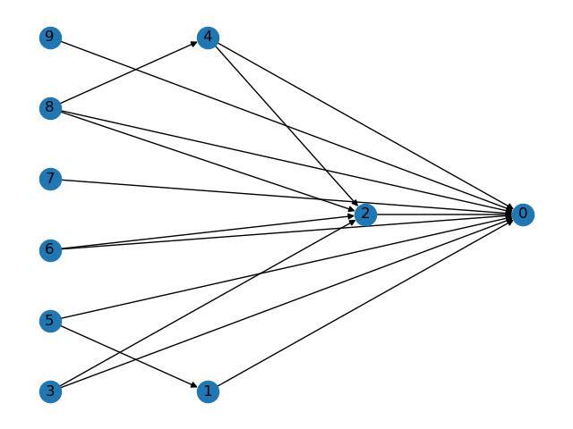
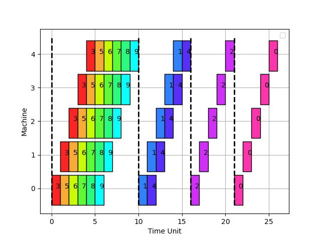
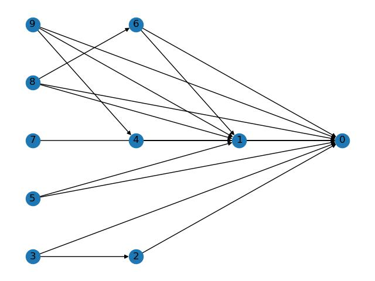
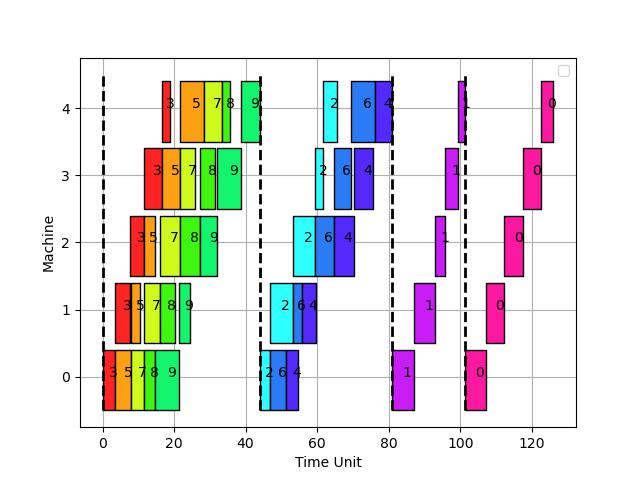

## QoS Final project algorithm implementation
This work is following a final project in the Quality Of Service course at Ben Gurion University of the Negev
 by Dr. Gabriel Scalosub.

### Background
This project follows work introduced in the paper "Reducing Makespans of DAG Scheduling through Interleaving Overlapping Resource Utilization" [[1]](#1), and specifically the content-free scheduling algorithm.

While in the original work, the scheduling algorithm considered two machines. A generalized algorithm for ``m`` machines is introduced in this work.

The algorithm is bounded by ```ALG <= m*OPT``` for the general case, and in the case of fixed size processing time for the stage phases, the bound is ```ALG <= OPT(1+(m-1)/m)```.

### Problem Definition
Consider ``n`` stages s.t each stage consists of ``m`` phases to execute in a pipeline, and a DAG (directed acyclic graph) that hold precedence of stages. If edge ``(s1,s2)`` is present in the graph,``s2`` must execute after ``s1`` is done. The stage can be described as vector ``s1=(p1,p2,..,pm)``. 
Each phase should execute on a dedicated machine (phase ``i`` on machine ``i``) and for ``i < j`` phase ``j``
should be executed after phase ``i`` was done.

### Simulator usage
The simulator supports command line arguments. At each run of the simulator, it will generate a random graph, 
vector stages for each stage with random or constant processing time for each phase controlled by the ``--type``.
The simulator may supply two plots: The DAG depicts the precedence between stages and the stage plot (as in the example). 
Since there are default values for the simulator running ``python main.py`` should produce results.

### Simulator input
``-n`` - Number of states for the experiment, argument type is int,and the default value is 10 <br>
``-m`` - Number of machines for the experiment, argument type is int,and the default value is 5 <br>
``-type`` - Phases processing time. \"random\" or \"constant\", argument type is str,and the default value is "random" <br>
``-plot_dag`` - True/False plot of the random DAG graph, argument type is bool,and the default value is True <br>
``-plot_scheduling`` - True/False plot of scheduling graph, argument type is bool,and the default value is True <br>

### Plot examples
#### Stage Phase Constant (1) Size:<br>
- DAG: <br>

- Scheduling: <br>>

- 
#### Stage Phase Random Size:<br>
- DAG: <br>>

- Scheduling: <br>


### References
<a id="1">[1]</a> Duan, Yubin, Ning Wang, and W. Jie. 
"Reducing Makespans of DAG Scheduling through Interleaving Overlapping Resource Utilization." 
2020 IEEE 17th International Conference on Mobile Ad Hoc and Sensor Systems (MASS). IEEE, 2020.